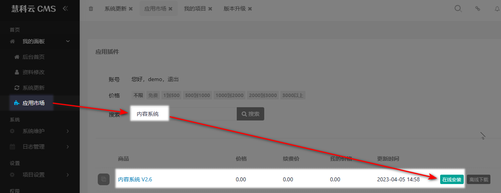
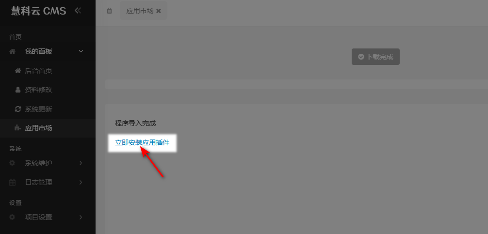
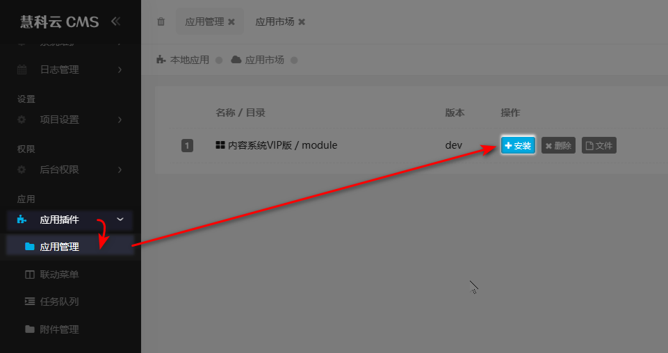
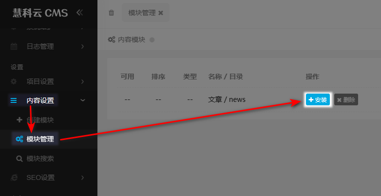

慧科云 CMS 首次安装进入后台时，后台是没有任何数据

## 下载内容系统

进入，我的面板 > 应用市场，搜索 `内容系统` 应用

   

## 安装内容系统

将下载的 `内容系统` 应用安装到系统中

                                                  
## 安装文章模块

通常情况下 `文章/news` 模块基本上站点都需要安装

