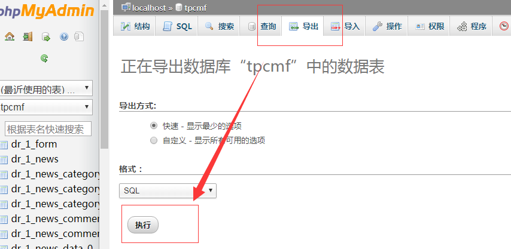
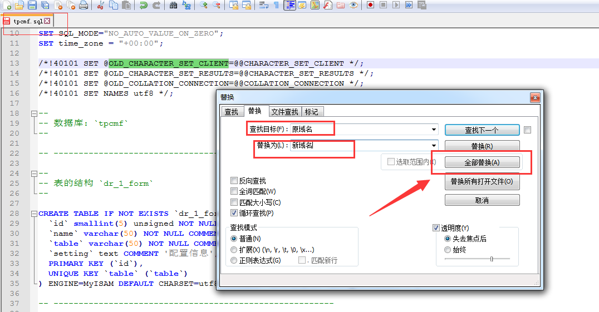
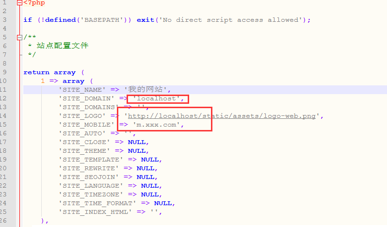

     
## 准备工作

按照 <a href="../../环境配置/PHP环境侦探工具" target="_blank">此方法</a> 检测目标服务器环境

## 情况一：前后网站域名相同

网站从 `服务器A` 迁移到 `服务器B` 时，需要做以下操作：

1. `服务器A` 域名和 `服务器B` 域名一致的情况下
2. 备份 `服务器A` 的全部文件和数据库，以免出错
3. `服务器A` 环境一定要保证能运行 CMS 程序，最好保持一致
4. 将 `服务器A` 网站文件全部上传到 `服务器B`
5. `服务器B` 目录文件权限要和 `服务器A` 一致，如果不懂，先暂且给服务器B可读写权限（0777）
6. 如果数据库账号和密码有变化的时候，需要手动修改文件： `/config/database.php`
7. 访问网站后台，并执行更新全站缓存
8. 如果没有错误情况的话，就表示迁移成功

## 情况二：前后网站域名不一样

网站从 `本地` 迁移到 `服务器` 时，两者域名不一样的情况下：

1. 保证服务器环境能正常安装 CMS
2. 在 `本地` ，使用 phpmyadmin 工具导出数据库文件，例如 xxxx.sql

3. 在 `本地` ，执行后会生成一个数据库文件，例如 xxx.sql
4. 在 `本地` ，打开这个 sql 文件，把 `本地` 域名替换成 `服务器` 的正式域名

5. 在 `本地` ，替换成功后，保存 sql 文件，再把这个 sql 导入进服务器的数据库中
6. 在 `本地` ，然后再把 `本地` 网站文件上传到 `服务器` 上
7. 在 `服务器` 上，linux服务器时，需要给一次全站777权限（迁移完成再按需设置权限）
8. 在 `服务器` 上，打开服务器中的配置文件： `cache/config/site.php` ，把里面的老域名改成新域名

9. 在 `服务器` 上，如果数据库账号和密码有变化的时候，需要手动修改文件： `/config/database.php` 
10. 在 `服务器` 上，访问网站后台，并执行更新全站缓存
11. 在 `服务器` 上，如果没有错误情况的话，就表示迁移成功
